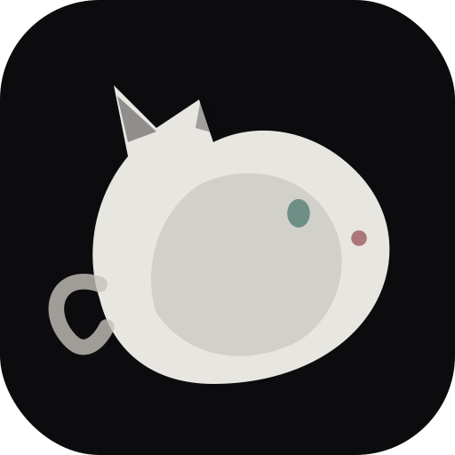
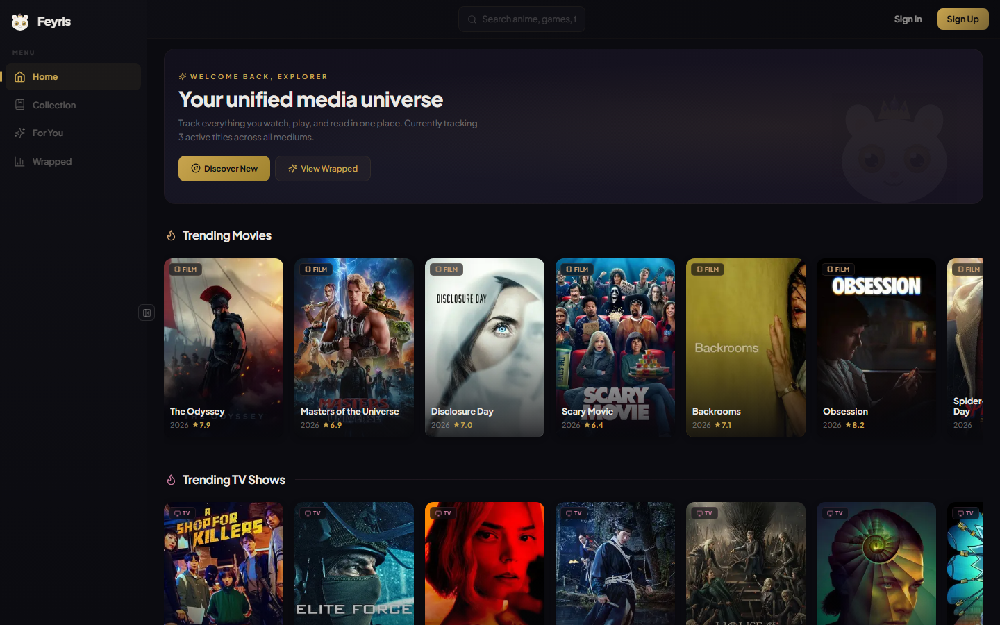
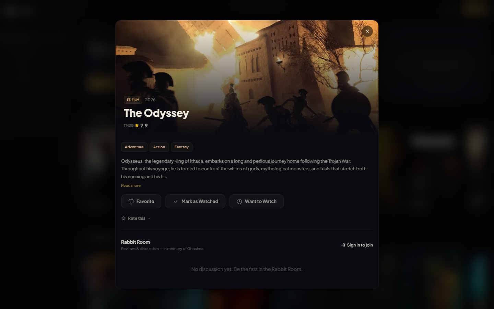
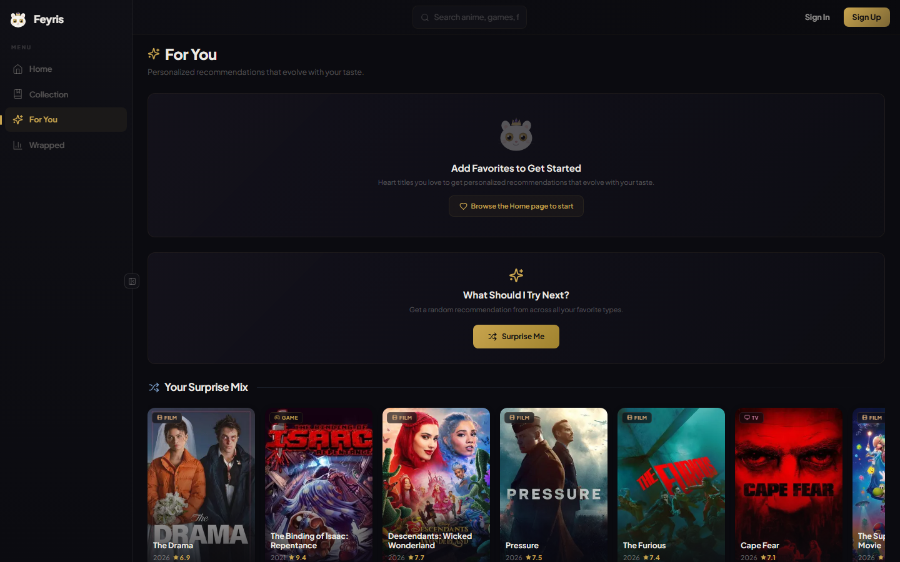
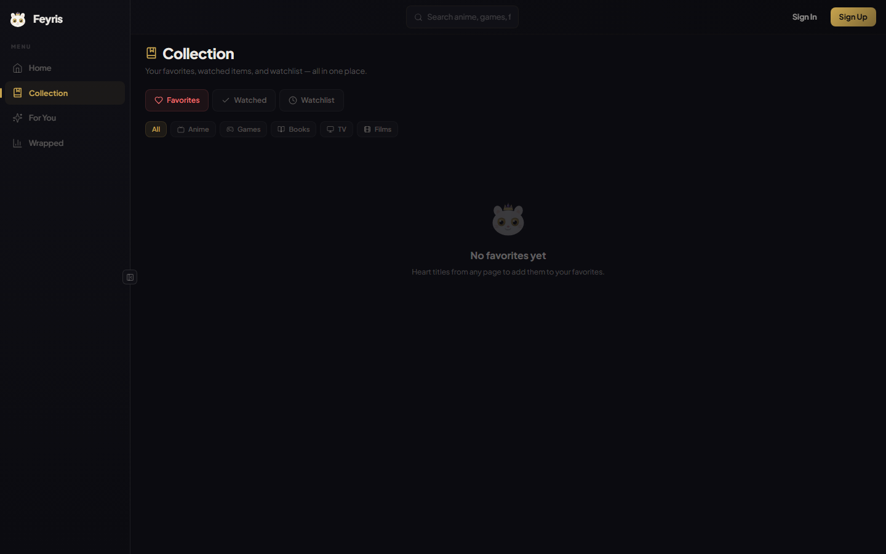
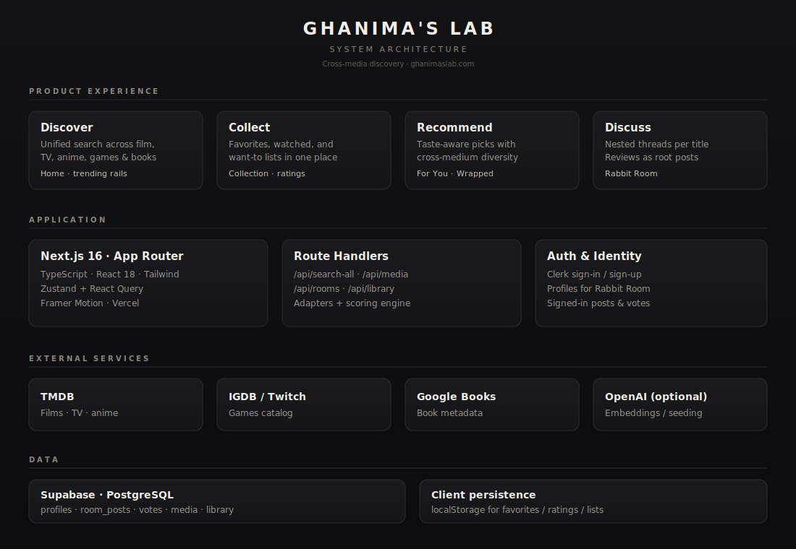

<p align="center">
  
</p>

<h1 align="center">Ghanima</h1>

<p align="center">
  <strong>A unified library for films, TV, anime, games, and books.</strong><br/>
  Discover across sources, collect what you love, get taste-aware recommendations,<br/>
  and discuss titles in the Rabbit Room.
</p>

<p align="center">
  <a href="https://feyrisrec.com">Live site</a>
  ·
  <a href="#why">Why</a>
  ·
  <a href="#product">Product</a>
  ·
  <a href="#architecture">Architecture</a>
  ·
  <a href="#roadmap">Roadmap</a>
</p>

<p align="center">
  
  
  
  
  
</p>

---

## Why

Most people don’t consume media in one silo. You finish a film, start the novel it was based on, then drop into a related game — but the tools for tracking taste stay fragmented.

**Ghanima** is a product experiment in *cross-medium continuity*: one library, one search surface, one recommendation loop, and structured discussion around each title.

Built as an end-to-end web product — scoping a real problem, shipping discovery UX, identity, collections, and community threads.

---

## Product

### Goals

| Goal | How it shows up |
|------|-----------------|
| Reduce context-switching across media apps | Single search + unified media model |
| Make taste legible | Collection, ratings, Wrapped |
| Recommend across mediums | For You scoring + diversity weighting |
| Encourage thoughtful discourse | Rabbit Room nested threads (sign-in required) |

### Surfaces

- **Home** — trending rails across film, TV, anime, games, and books  
- **Collection** — favorites, watched / played / read, want-to lists  
- **For You** — personalized recommendations from library signals  
- **Wrapped** — year-in-review style snapshot  
- **Rabbit Room** — per-title reviews & nested discussion  

### Screenshots

<p align="center">
  
  <br/><em>Homepage — unified discovery</em>
</p>

<p align="center">
  
  <br/><em>Media detail — actions and Rabbit Room</em>
</p>

<p align="center">
  
  <br/><em>For You — taste-aware recommendations</em>
</p>

<p align="center">
  
  <br/><em>Collection — favorites, watched, watchlist</em>
</p>

---

## Architecture

<p align="center">
  
</p>

**Experience** — Discover, collect, recommend, discuss.  
**Application** — Next.js App Router (TypeScript), Zustand + React Query, Route Handlers, Clerk auth.  
**Services** — TMDB, IGDB / Twitch, Google Books; optional OpenAI for seeding.  
**Data** — Supabase Postgres (profiles, library, Rabbit Room); localStorage for lightweight client lists.

---

## Tech stack

| Layer | Choice |
|-------|--------|
| Framework | Next.js 16 (App Router) |
| Language | TypeScript |
| UI | React 18, Tailwind CSS, Framer Motion |
| Client state | Zustand, TanStack Query |
| Auth | Clerk |
| Database | Supabase (PostgreSQL) |
| Media APIs | TMDB, IGDB / Twitch, Google Books |
| Hosting | Vercel |

---

## Quick start

### Prerequisites

- Node.js 18+
- API keys for TMDB, Twitch (IGDB), Google Books, Supabase, and Clerk

### Setup

```bash
git clone https://github.com/JonathanDunkleberger/Feyris.git
cd Feyris
npm install
cp .env.local.example .env.local
```

Fill in `.env.local`, then:

```bash
npm run dev
```

Open [http://localhost:3000](http://localhost:3000).

### Rabbit Room schema

Run [`supabase/rabbit_room_schema.sql`](supabase/rabbit_room_schema.sql) once in the Supabase SQL Editor to create `profiles`, `room_posts`, and `room_post_votes`.

---

## Environment

### Server-side (secret)

| Variable | Purpose |
|----------|---------|
| `TMDB_API_KEY` | Film, TV, anime |
| `TWITCH_CLIENT_ID` / `TWITCH_CLIENT_SECRET` | IGDB games |
| `GOOGLE_BOOKS_API_KEY` | Books |
| `OPENAI_API_KEY` | Optional embeddings / seeding |
| `SUPABASE_SERVICE_ROLE_KEY` | Server writes |
| `CLERK_SECRET_KEY` | Auth |

### Client-side (public)

| Variable | Purpose |
|----------|---------|
| `NEXT_PUBLIC_SUPABASE_URL` | Supabase URL |
| `NEXT_PUBLIC_SUPABASE_ANON_KEY` | Supabase anon key |
| `NEXT_PUBLIC_CLERK_PUBLISHABLE_KEY` | Clerk publishable key |
| `NEXT_PUBLIC_DISCORD_INVITE_URL` | Optional |

---

## Repository layout

```
Feyris/                   # repo name (legacy)
├── app/                  # App Router + API routes
├── components/           # UI
├── hooks/                # Data hooks
├── lib/                  # Adapters, recommendations, Supabase
├── stores/               # Zustand
├── supabase/             # SQL schemas
├── docs/                 # Architecture + screenshots
├── public/               # Static assets
└── scripts/              # Utilities
```

---

## Roadmap

Shipped:

- [x] Cross-source search and trending rails  
- [x] Collection, ratings, For You, Wrapped  
- [x] Clerk authentication  
- [x] Rabbit Room (persisted nested discussion)  
- [x] Silver visual system  

Next:

- [ ] Public profiles with post history  
- [ ] Standalone Rabbit Room index  
- [ ] Moderation / report flows  
- [ ] Recommendation evaluation hooks  
- [ ] Imports (Letterboxd / MAL / Goodreads)  
- [ ] Accessibility & performance pass  
- [ ] Custom domain aligned to product name  

---

## Design principles

1. **One composition for discovery** — Home should feel like a media universe, not a dashboard dump.  
2. **Identity when it matters** — Browsing is open; discourse requires an account.  
3. **Cross-medium first** — Recommendations should travel across formats.  
4. **Quiet visual language** — Cool silver / pearl accents on charcoal; restraint over spectacle.

---

## Attribution

- Film / TV / anime via [TMDB](https://www.themoviedb.org/) (not endorsed or certified by TMDB)  
- Games via [IGDB](https://www.igdb.com/) / Twitch API  
- Books via [Google Books](https://developers.google.com/books)  
- Logos and trademarks belong to their respective owners  

---

## License

MIT — see [`LICENSE`](LICENSE).

---

<p align="center">
  <sub>Jonathan Dunkleberger · Product case study · <a href="https://feyrisrec.com">feyrisrec.com</a></sub>
</p>
